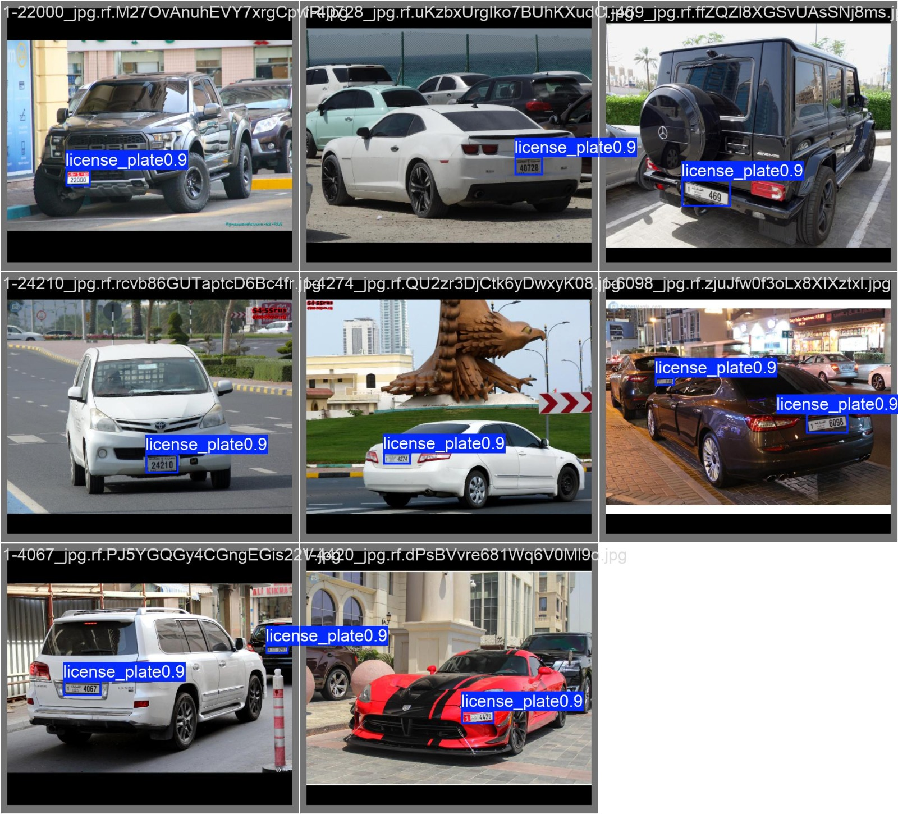
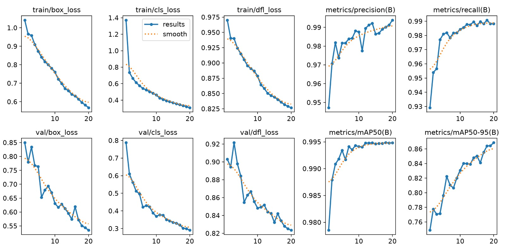
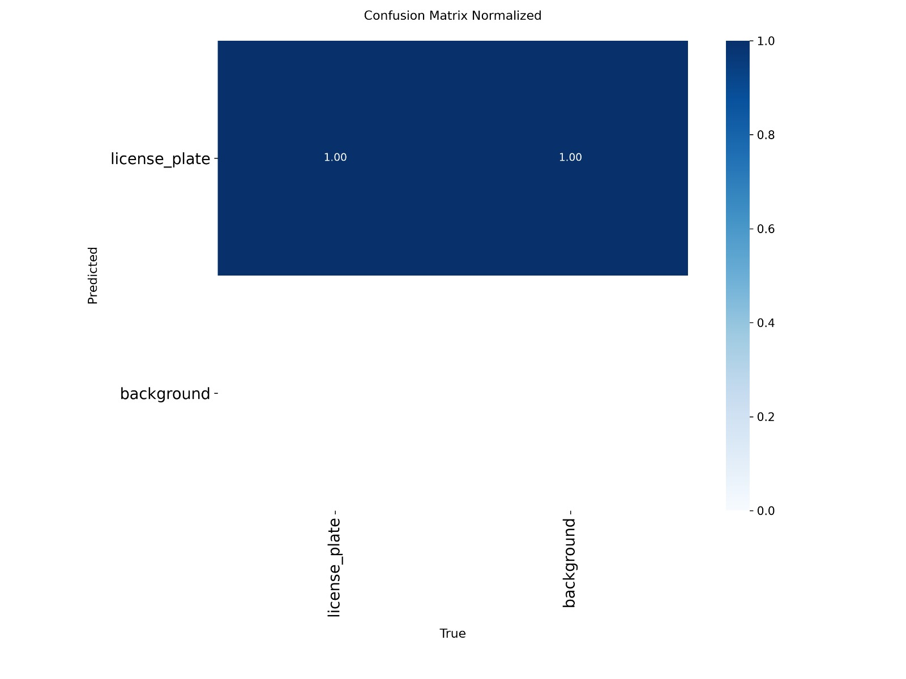

# UAE License Plate Detection using RT-DETR

Real-time UAE license plate detection benchmark using RT-DETR with YOLOv8 baseline comparison.

---

## Highlights

- RT-DETR real-time object detection
- YOLOv8 baseline comparison
- UAE License Plate dataset
- Complete preprocessing pipeline
- Training curves and evaluation results
- COCO + YOLO annotations

## Results

| Metric | Value |
|--------|-------|
| Precision | 99.11% |
| Recall | 99.14% |
| F1 Score | 99.12% |
| mAP@50 | 99.49% |
| mAP@50-95 | 86.07% |
| Speed | 2.30 ms/image (~435 FPS) |

## Sample Predictions



## Training Curves



## Confusion Matrix



## Pipeline

Dataset
↓

Preprocessing

↓

Data Augmentation

↓

RT-DETR Training

↓

Evaluation

↓

Benchmarking

↓

Visualization


## 1. Project purpose

This repository is the reproducible preprocessing handoff for a UAE license-plate object-detection dataset. It preserves one audited release membership, one full-plate target class, YOLO labels, COCO annotations, integrity manifests, validation code, figures, and an executed analysis notebook. Model training is deliberately outside this repository.

## 2. Preprocessing scope

The source export contains 51 annotation classes and 86,294 boxes across 9,985 image/label pairs. Preprocessing selects the unique source class named `plate`, remaps it to class `0 license_plate`, and removes OCR digits, letters, expiration, emirate, and style boxes. The accepted release contains 9,610 nonempty labels and 12,451 complete-plate boxes.

The accepted membership and label contents are frozen. `scripts/preprocess_dataset.py --audit-existing` validates that release and regenerates derived metadata without changing membership. `--build-from-raw` reconstructs the same release into a separate staging directory and never overwrites the accepted dataset.

## 3. Dataset source and CC BY 4.0 attribution

- Dataset: UAE
- Canonical source: https://universe.roboflow.com/addinguae/uae-zcfqj
- License: CC BY 4.0

See `DATASET_ATTRIBUTION.md` for the target-filtering explanation, the distinction between dataset and code licensing, and the local raw-export URL discrepancy.

## 4. Full-plate target definition

The only target is the complete visible license plate:

```yaml
nc: 1
names:
  0: license_plate
```

Character-level and plate-style annotations are not detection targets. Every committed YOLO label row has five finite values, class ID `0`, positive width and height, and a normalized box fully inside the image. Crop-heavy training examples are intentionally retained as valid full-plate training examples.

## 5. Final dataset counts

| Split | Images | YOLO labels | Boxes |
|---|---:|---:|---:|
| Train | 6,738 | 6,738 | 9,415 |
| Validation | 1,440 | 1,440 | 1,525 |
| Test | 1,432 | 1,432 | 1,511 |
| Total | 9,610 | 9,610 | 12,451 |

## 6. Data-cleaning accounting

| Metric | Count |
|---|---:|
| Source images | 9,985 |
| Images with no `plate` box removed | 359 |
| Plate-only candidate images | 9,626 |
| Images excluded by release decisions | 16 |
| Final images | 9,610 |
| Source boxes | 86,294 |
| Non-target boxes removed | 73,826 |
| Source `plate` boxes | 12,468 |
| Plate boxes belonging to excluded images | 17 |
| Final plate boxes | 12,451 |
| Total boxes not in the final release | 73,843 |

`reports/preprocessing_audit.csv`, `reports/class_mapping.csv`, and `reports/excluded_images.csv` provide machine-readable evidence. Eleven exclusions are conservative project-owner decisions based on cross-split scene similarity. The provenance of five frozen-release omissions is unavailable, so no unsupported defect claim is attached to them.

## 7. Train/validation/test policy

The release uses frozen project-controlled approximately 70/15/15 membership recorded by `reports/dataset_manifest.csv`. The original membership-generation seed and exact grouping algorithm are not independently reconstructable from the committed evidence. The validator therefore checks the recorded membership and hashes rather than resplitting it.

Training, validation, and test remain separate. Validation is for model selection; test is reserved for final evaluation. Exact SHA-256 collisions across splits fail validation. The optional difference-hash scan reports current candidates without deleting images.

## 8. Augmentation policy

`configs/augmentation_policy.yaml` is a preprocessing handoff, not an assertion that augmentation is integrated into training code. Random augmentation is training-only; validation and test receive no random augmentation. Horizontal and vertical flips are disabled. Mild rotation, scale, translation, brightness, contrast, Gaussian blur, and constrained crop settings preserve bounding-box visibility.

Normalization and deterministic resizing are model- and weight-specific runtime decisions. Stored release images are not permanently normalized or resized by this repository.

## 9. Proposed model handoff

- YOLO is the proposed baseline and can consume the YOLO dataset plus `data.yaml`.
- RT-DETR is a proposed detection-transformer comparison.
- RF-DETR is the proposed main real-time transformer model.
- Detection-transformer implementations can consume `annotations/coco/{train,val,test}.json`.

YOLO, RT-DETR, and RF-DETR are proposals only. No model training or model implementation is included here.

## 10. Repository structure

```text
.
|-- DATASET_ATTRIBUTION.md
|-- README.md
|-- data.yaml
|-- dataset_release.json
|-- requirements.txt
|-- annotations/coco/{train,val,test}.json
|-- configs/augmentation_policy.yaml
|-- datasets/uae_lp_v2_yolo/
|   |-- data.yaml
|   `-- labels/{train,val,test}/*.txt
|-- notebooks/01_data_preprocessing.ipynb
|-- reports/
|   |-- class_mapping.csv
|   |-- dataset_manifest.csv
|   |-- dataset_stats.csv
|   |-- excluded_images.csv
|   |-- preprocessing_audit.csv
|   |-- split_leakage_candidates.csv
|   |-- validation_report.md
|   `-- figures/
`-- scripts/
    |-- check_split_leakage.py
    |-- generate_reports.py
    |-- preprocess_dataset.py
    |-- preprocessing_utils.py
    |-- validate_dataset.py
    `-- visualize_dataset.py
```

Image files are intentionally absent from GitHub and distributed separately.

## 11. Install instructions

Python 3.14.5 was used for the validated environment.

```text
python -m venv .venv
.venv/Scripts/python -m pip install --upgrade pip
.venv/Scripts/python -m pip install -r requirements.txt
```

On POSIX systems, use `.venv/bin/python` instead.

## 12. Repository validation

A clean GitHub clone can run repository validation without image files:

```text
python scripts/validate_dataset.py --mode repository
```

This validates repository hygiene, all 9,610 labels, 12,451 boxes, both YAML files, COCO structure and 0.01-pixel parity, the active manifest, committed label hashes, release hashes, exclusion decisions, and recorded exact cross-split image-hash uniqueness. Image-dependent checks are reported as `NOT_RUN_IMAGES_NOT_INCLUDED`.

## 13. Full-dataset validation

After placing the separate image archive as described below, run:

```text
python scripts/validate_dataset.py --mode full
```

Full mode additionally decodes all 9,610 images, verifies dimensions and SHA-256 hashes, runs current exact and difference-hash leakage checks, and regenerates the visual contact sheets. `--mode auto` chooses full mode only when every expected image is present; otherwise it chooses repository mode.

## 14. Raw-source reconstruction

Audit the existing release and regenerate the manifest, class mapping, COCO files, audit ledger, and release metadata:

```text
python scripts/preprocess_dataset.py --audit-existing --source-root path/to/raw/export
```

Reconstruct from the original multiclass export into a new staging directory:

```text
python scripts/preprocess_dataset.py --build-from-raw --source-root path/to/raw/export --staging-root release_artifacts/reconstructed
```

The raw source must have 51 classes, class 50 named `plate`, 9,985 image/label pairs, and 86,294 boxes. Reconstruction indexes the source, keeps only `plate`, maps it to class 0, copies the matching images, compares normalized labels and hashes with the active manifest, and checks COCO parity. It never replaces the accepted dataset automatically.

## 15. Dataset image placement

Extract the separately distributed full image archive into:

```text
datasets/uae_lp_v2_yolo/images/train
datasets/uae_lp_v2_yolo/images/val
datasets/uae_lp_v2_yolo/images/test
```

Expected counts are 6,738 train images, 1,440 validation images, and 1,432 test images. These directories are ignored by Git and must not be committed.

## 16. Known limitations

- Images are intentionally omitted from the GitHub source repository and distributed separately.
- The exact historical reason for five frozen-release omissions is unavailable.
- The local raw export metadata used a different Roboflow workspace URL from the required canonical attribution URL.
- The augmentation policy is a preprocessing handoff and is not claimed as integrated into model training.
- The repository proposes YOLO, RT-DETR and RF-DETR but does not claim those models are implemented here.

## 17. Course-material mapping

| Repository topic | Course mapping |
|---|---|
| Data cleaning | Project Guidelines |
| Train/validation/test separation | 11-TrainingCNN |
| Normalization | 11-TrainingCNN and the professor's pretrained-model notebook |
| Rotation, scale, and crop augmentation | 11-TrainingCNN and professor `12-trainingCNN.ipynb` |
| Gaussian blur | 03-Filtering |
| Full-object bounding boxes and YOLO | 13-Detection&Segmentation |
| SHA-256, difference hashing, COCO conversion, semantic versioning, and manifest hashing | Project engineering, not directly taught lecture techniques |

SIFT, corners, blobs, optical flow, multiview geometry, and edge detection are not claimed as parts of this preprocessing pipeline.

## 18. AI assistance acknowledgment

Generative AI tools, including ChatGPT and Codex, assisted with portions of code structure, debugging, validation design, and documentation. AI use is permitted for the course project with acknowledgment. All reported dataset counts and annotation checks are produced by the repository's validation code and were independently verified before release.
