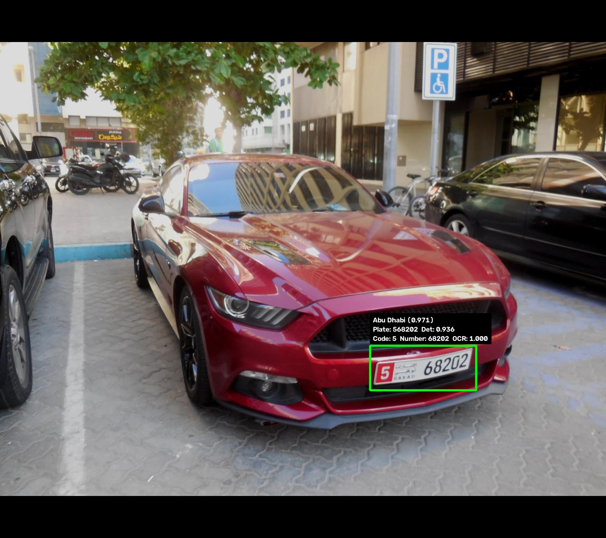
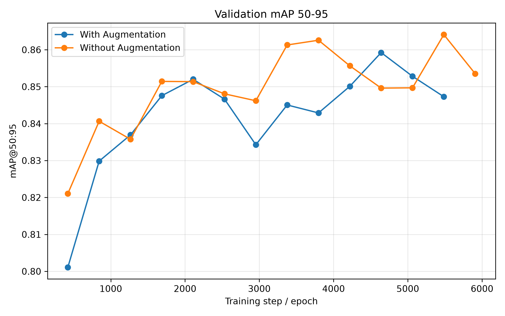
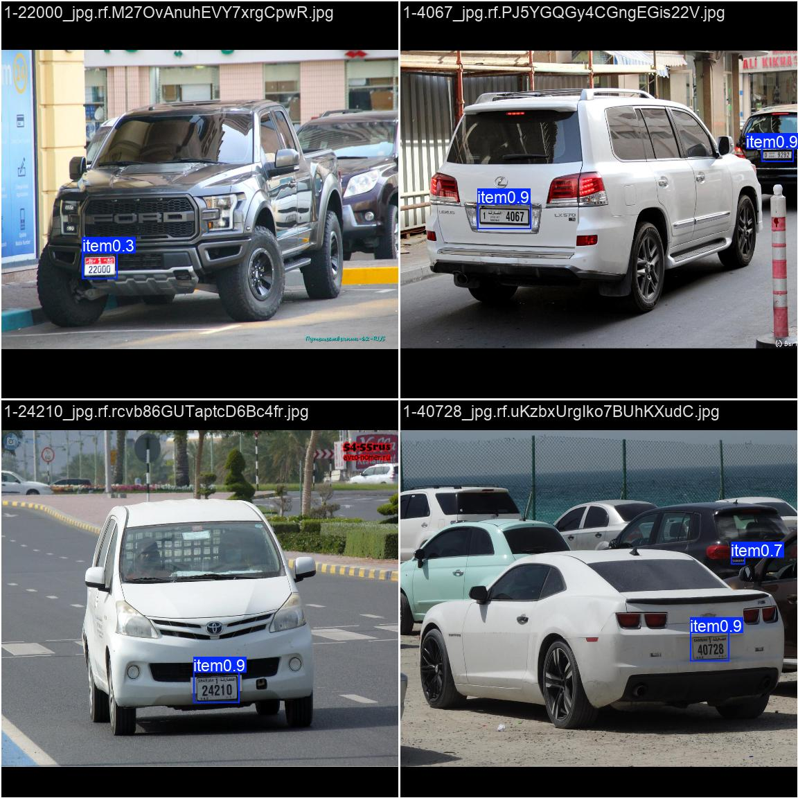

# End-to-End UAE License Plate Detection and Recognition

A COE-486 Computer Vision semester project that extends **RF-DETR** from plate localization into a UAE-specific recognition pipeline. The repository includes dataset cleaning and validation, controlled augmentation, three detector comparisons, OCR, seven-emirate classification, an ablation study, and a final qualitative demo.

## Extend and Innovate

This project follows **Option 2: Extend and Innovate**.

### Base method

- **RF-DETR Medium** is used as the main real-time detection-transformer method for locating complete license plates.

### Project extensions

- Built a UAE-specific dataset cleaning, auditing, and format-conversion pipeline.
- Converted the same frozen split to both YOLO and COCO formats.
- Designed training-time augmentation and evaluated it with an RF-DETR on/off ablation.
- Compared RF-DETR Medium against YOLOv8n and RT-DETR-L.
- Added plate-text recognition using FastPlateOCR.
- Added seven-class emirate classification using ResNet18.
- Added train-derived parsing of plate code and registration number.
- Integrated the components into one end-to-end qualitative demonstration pipeline.

## Final Pipeline

```text
Vehicle image
    ↓
RF-DETR Medium plate detector
    ↓
Padded plate crop
    ↓
OCR v2 text recognizer
    ↓
ResNet18 emirate classifier
    ↓
Train-derived code/number parser
    ↓
Annotated image + structured JSON output
```

## Key Results

### Detector comparison

All detector results use the same frozen test split of **1,432 images and 1,511 plate instances**.

| Model | mAP@50:95 | mAP@50 | mAP@75 | Precision | Recall | Reported speed |
|---|---:|---:|---:|---:|---:|---:|
| YOLOv8n | 0.8607 | 0.9949 | — | 0.9911 | 0.9914 | 2.30 ms/image (~435.6 FPS) |
| RT-DETR-L | 0.8639 | 0.9944 | 0.9806 | 0.9774 | 0.9921 | 13.61 ms/image |
| RF-DETR Medium | **0.8664** | **0.9965** | **0.9844** | 0.9914 | 0.9921 | 87.12 ms/image (11.48 FPS) |

RF-DETR precision and recall use a confidence threshold selected on validation and frozen before test evaluation. Speed was measured using different frameworks and timing procedures, so the speed column is not a controlled hardware comparison.

Machine-readable results:

```text
results/metrics/yolov8/test_metrics.json
results/metrics/rtdetr/test_metrics.json
results/metrics/rfdetr/
```

### RF-DETR augmentation ablation

| Configuration | mAP@50:95 | mAP@50 | mAP@75 | AR@100 |
|---|---:|---:|---:|---:|
| With augmentation | 0.8664 | **0.9965** | **0.9844** | 0.9027 |
| Without augmentation | **0.8666** | 0.9903 | 0.9777 | **0.9060** |

The overall mAP@50:95 difference was negligible. Augmentation improved AP at IoU 0.50 and 0.75, while the no-augmentation run produced slightly higher average recall.

### OCR evaluation

| Evaluation | Test crops | Exact plate accuracy | Character accuracy | Plate-length accuracy |
|---|---:|---:|---:|---:|
| OCR v1, original test | 1,017 | 97.94% | 99.72% | 99.71% |
| OCR v2, original test | 1,017 | **98.23%** | **99.77%** | **99.90%** |
| OCR v2, Abu Dhabi numeric subset | 173 | 86.13% | 97.56% | 95.38% |

OCR v2 was introduced after numeric-prefix Abu Dhabi failures were observed. No combined OCR v2 test accuracy is claimed because that combined evaluation file was not available.

### Emirate classifier

| Metric | Result |
|---|---:|
| Test crops | 1,466 |
| Accuracy | 99.59% |
| Balanced accuracy | 97.71% |
| Macro F1 | 98.54% |
| Weighted F1 | 99.59% |

The classifier predicts Abu Dhabi, Ajman, Dubai, Fujairah, Ras Al Khaimah, Sharjah, and Umm Al Quwain. The recovered dataset is imbalanced, so balanced accuracy and macro F1 should be considered alongside overall accuracy.

## Qualitative Results

### Final end-to-end example



### YOLOv8n predictions


### RF-DETR training curve



### RT-DETR-L validation predictions



## Dataset

The detector dataset was derived from the **UAE** dataset on Roboflow Universe.

- Canonical source: https://universe.roboflow.com/addinguae/uae-zcfqj
- Dataset license: CC BY 4.0
- Detection target: one complete visible license plate

The source export contained 51 annotation classes and 86,294 boxes across 9,985 image/label pairs. Preprocessing retained only the complete-plate class, mapped it to class `0`, and removed character-level, emirate, expiration, and style boxes.

```yaml
nc: 1
names:
  0: license_plate
```

| Split | Images | YOLO labels | Plate boxes |
|---|---:|---:|---:|
| Train | 6,738 | 6,738 | 9,415 |
| Validation | 1,440 | 1,440 | 1,525 |
| Test | 1,432 | 1,432 | 1,511 |
| **Total** | **9,610** | **9,610** | **12,451** |

Training, validation, and test membership is frozen. Validation is used for model selection, and test is reserved for final evaluation. See `DATASET_ATTRIBUTION.md` for full attribution and preprocessing details.

## Repository Structure

```text
.
├── README.md
├── DATASET_ATTRIBUTION.md
├── .gitignore
├── requirements.txt
├── requirements-windows-cu128.txt
├── data.yaml
├── dataset_release.json
├── annotations/
│   └── coco/{train,val,test}.json
├── configs/
│   └── augmentation_policy.yaml
├── datasets/
│   └── uae_lp_v2_yolo/
│       ├── data.yaml
│       └── labels/{train,val,test}/
├── docs/
│   └── CHECKPOINTS.md
├── figures/
│   └── YOLOv8n curves, confusion matrix, and examples
├── notebooks/
│   └── 01_data_preprocessing.ipynb
├── reports/
│   ├── dataset manifests and preprocessing audits
│   └── figures/
├── results/
│   ├── metrics/{yolov8,rtdetr,rfdetr,ocr,emirate}/
│   ├── figures/{rtdetr,rfdetr,ocr,emirate}/
│   ├── examples/{rfdetr,final_pipeline}/
│   └── results.csv
├── scripts/
│   ├── preprocessing and validation
│   ├── YOLO/RT-DETR/RF-DETR support
│   ├── OCR preparation and evaluation
│   ├── emirate classification
│   └── final end-to-end pipeline
└── weights/
    └── best.pt
```

`weights/best.pt` is the small YOLOv8n checkpoint. Large checkpoints and generated derivative datasets are distributed separately.

## Installation

Python 3.10–3.13 is recommended. A CUDA-capable NVIDIA GPU is strongly recommended for detector training and benchmarking.

### Cross-platform setup

```bash
git clone https://github.com/samsio2005/UAE-License-Plate-Detection-RT-DETR.git
cd UAE-License-Plate-Detection-RT-DETR
python -m venv .venv
```

Windows PowerShell:

```powershell
.\.venv\Scripts\Activate.ps1
python -m pip install --upgrade pip
pip install -r requirements.txt
```

macOS/Linux:

```bash
source .venv/bin/activate
python -m pip install --upgrade pip
pip install -r requirements.txt
```

The complete Windows CUDA 12.8 environment captured from the training machine is preserved in `requirements-windows-cu128.txt`. Use it only on a compatible Windows/CUDA environment.

Verify PyTorch:

```bash
python -c "import torch; print(torch.__version__); print('CUDA:', torch.cuda.is_available())"
```

## Dataset Image Placement

Images are intentionally excluded from GitHub. Place the separately distributed detector images at:

```text
datasets/uae_lp_v2_yolo/images/train
datasets/uae_lp_v2_yolo/images/val
datasets/uae_lp_v2_yolo/images/test
```

Expected counts:

- Train: 6,738
- Validation: 1,440
- Test: 1,432

## Checkpoints and External Artifacts

Download the large checkpoints and generated artifacts from:

https://drive.google.com/drive/folders/11NIEo7Cx430th-ADQH7vAt1NhTNl5QRZ

Placement details are documented in [`docs/CHECKPOINTS.md`](docs/CHECKPOINTS.md). Confirm before submission that the link is accessible without the owner's account.

Required paths for the full demo:

```text
runs/rfdetr_medium_main/checkpoint_best_total.pth
runs/ocr_uae_v2_retry/<completed-run>/best.keras
runs/ocr_uae_v2_retry/<completed-run>/plate_config.yaml
runs/emirate_resnet18_main/best.pt
results/emirate_code_rules.json
```

## Dataset Validation and Preprocessing

Validate the image-free GitHub package:

```bash
python scripts/validate_dataset.py --mode repository
```

Run full image-dependent validation after placing the image archive:

```bash
python scripts/validate_dataset.py --mode full
```

Check cross-split leakage:

```bash
python scripts/check_split_leakage.py --mode full
```

Audit the accepted release without changing membership:

```bash
python scripts/preprocess_dataset.py --audit-existing --source-root path/to/raw/export
```

Reconstruct the release in a separate staging directory:

```bash
python scripts/preprocess_dataset.py --build-from-raw \
  --source-root path/to/raw/export \
  --staging-root release_artifacts/reconstructed
```

## YOLOv8n Baseline

Training configuration: 20 epochs, batch size 8, image size 640, four workers, seed 486.

Train:

```bash
yolo detect train \
  model=yolov8n.pt \
  data=datasets/uae_lp_v2_yolo/data.yaml \
  epochs=20 batch=8 imgsz=640 workers=4 seed=486 \
  project=runs name=yolov8n_main_20e
```

Evaluate the committed checkpoint on the test split:

```bash
yolo detect val \
  model=weights/best.pt \
  data=datasets/uae_lp_v2_yolo/data.yaml \
  split=test imgsz=640 batch=8
```

## RF-DETR Medium

Prepare the COCO directory layout:

```bash
python scripts/prepare_rfdetr_dataset.py
```

Train the main augmented model:

```bash
python scripts/train_rfdetr_main.py
```

Train the controlled no-augmentation ablation:

```bash
python scripts/train_rfdetr_no_aug.py
```

Evaluate and benchmark:

```bash
python scripts/evaluate_rfdetr_test.py
python scripts/evaluate_fixed_threshold.py
python scripts/benchmark_rfdetr.py
python scripts/export_rfdetr_curves.py
```

Main checkpoint:

```text
runs/rfdetr_medium_main/checkpoint_best_total.pth
```

## RT-DETR-L

Validate the environment and split without starting training:

```bash
python scripts/train_rtdetr_l.py --check-only
```

Train and automatically evaluate the best checkpoint on the untouched test split:

```bash
python scripts/train_rtdetr_l.py
```

Main configuration:

- Input: 576 × 576
- Maximum epochs: 20
- Physical batch: 4
- Nominal batch: 16
- Optimizer: AdamW
- Initial learning rate: 1e-4
- Early-stopping patience: 4
- Seed: 486

## OCR

Install OCR training support:

```bash
pip install "fast-plate-ocr[train]>=1.1,<2"
```

Build OCR v1 crops and annotations:

```bash
python scripts/build_ocr_dataset.py
```

Build OCR v2 by adding strict numeric-prefix Abu Dhabi examples while preserving the split:

```bash
python scripts/build_ocr_v2_dataset.py
```

Fine-tuning was performed using FastPlateOCR's `train` CLI with CCT-S, batch size 64, learning rate `5e-5`, maximum 15 epochs, and early-stopping patience 4, initialized from the OCR v1 `best.keras`. The package exposes all available options through:

```bash
fast-plate-ocr train --help
```

The training command follows this form, using the generated CSV files and the model/plate configs stored beside the downloaded checkpoint:

```bash
KERAS_BACKEND=torch fast-plate-ocr train \
  --model-config-file path/to/model_config.yaml \
  --plate-config-file path/to/plate_config.yaml \
  --annotations datasets/uae_lp_ocr_v2/train/annotations.csv \
  --val-annotations datasets/uae_lp_ocr_v2/val/annotations.csv \
  --weights-path runs/ocr_uae_main/<completed-run>/best.keras \
  --epochs 15 \
  --batch-size 64 \
  --output-dir runs/ocr_uae_v2_retry
```

Evaluate OCR v1:

```bash
python scripts/evaluate_ocr_test.py
```

Evaluate OCR v2 on the original test subset:

```bash
python scripts/evaluate_ocr_test.py \
  --run-root runs/ocr_uae_v2_retry \
  --annotations datasets/uae_lp_ocr/test/annotations.csv \
  --output-dir results/ocr_uae_v2_original_test
```

Evaluate the numeric-prefix Abu Dhabi subset:

```bash
python scripts/evaluate_ocr_test.py \
  --run-root runs/ocr_uae_v2_retry \
  --annotations datasets/uae_lp_ocr_v2/abu_dhabi_numeric_test/annotations.csv \
  --output-dir results/ocr_uae_v2_abu_dhabi_test
```

## Emirate Classification

Recover emirate-labelled crops from the original 51-class export:

```bash
python scripts/build_emirate_dataset.py
python scripts/finalize_emirate_labels.py
```

Validate the generated dataset:

```bash
python scripts/train_emirate_classifier.py --check-only
```

Train and evaluate the seven-class ResNet18 model:

```bash
python scripts/train_emirate_classifier.py
```

Generate train-derived code/number parsing rules:

```bash
python scripts/build_emirate_code_rules.py
```

## Final End-to-End Demo

After placing the external artifacts, run:

```bash
python scripts/run_final_uae_plate_pipeline_v2.py \
  --image path/to/vehicle_image.jpg
```

The demo saves:

- an annotated vehicle image;
- detected plate crops;
- detector confidence;
- OCR text and character confidence;
- predicted emirate and confidence;
- parsed plate code and number; and
- a structured JSON result.

Curated outputs are available under `results/examples/final_pipeline/`. These are qualitative demonstrations, not a complete end-to-end test-set accuracy.

## Known Limitations

- Full image archives and large model checkpoints are distributed separately.
- Detector speed measurements use different frameworks and timing procedures.
- The detector dataset has one target class: complete visible plates.
- Source annotations contain some errors, including occasional non-plate boxes.
- The recovered emirate dataset is strongly imbalanced toward Dubai.
- Umm Al Quwain has few test crops, increasing class-level uncertainty.
- OCR v2 remains weaker on the difficult numeric-prefix Abu Dhabi subset.
- Loose, shifted, blurred, or incomplete detector crops can reduce downstream OCR and classification quality.
- The final examples are qualitative; no full end-to-end accuracy is claimed.

## Course Context

Developed for the **COE-486 Computer Vision Semester Project** at the **American University of Sharjah**.

## AI Assistance Acknowledgment

Generative AI tools, including ChatGPT and Codex, assisted with portions of code structure, debugging, validation design, repository assembly, and documentation. Dataset counts and model results were produced by the project scripts and reviewed by the team before release.

## Attribution

The UAE source dataset is licensed under **CC BY 4.0**. See `DATASET_ATTRIBUTION.md` for attribution and the preprocessing explanation.
